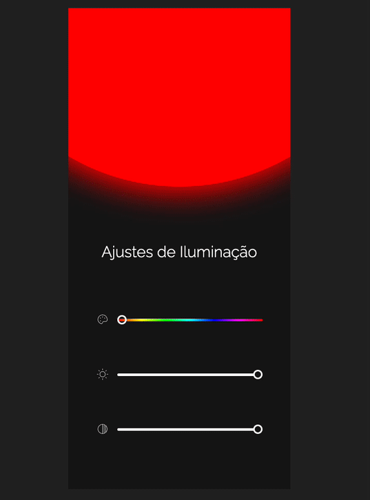

<h2 align="center"> Ajustes de Iluminação   💡🔴🔵🟢🟡🟣💡</h2>

Desafio 24 do #boraCodar da Rocketseat. Toda quarta-feira é lançado um desafio inédito para a comunidade tentar desenvolver e treinar suas habilidades do seu jeito 🚀⚡.  

- [Overview](#overview)
  - [Sobre o projeto](#sobre)
  - [Screenshots](#screenshots)
  - [Links](#links)
  - [My process](#my-process)
  - [Desenvolvido com](#tecnologias)
  - [Recursos úteis](#recursos-úteis)
- [Author](#autor)

 

## Overview
### Sobre
O desafio dessa semana foi um app de ajustes de iluminação. Nele podemos escolher a cor, tom de iluminação e o contraste.

### Screenshots

  

### Links
- [Acesse o projeto finalizado, online ☁️](https://joaoalisonti.github.io/ajustes-de-iluminacao/)

 

- [Acesse o figma do projeto 🔖](https://www.figma.com/community/file/1250810959627241982)

 

## My process
### Tecnologias
### ⚙️👨‍💻
Esse projeto foi desenvolvido com as seguintes tecnologias:

- HTML
- CSS
- JavaScript
- Git e Github

<!--### Continuar o desenvolvimento
Pretendo adicionar...-->

### Recursos úteis
- [JavaScript - Manipulação do DOM](https://developer.mozilla.org/pt-BR/docs/Web/API/Document_Object_Model/Introduction).
- [Site da Rocketseat](https://www.rocketseat.com.br/).
- [Desafios do #boraCodar](https://www.rocketseat.com.br/boracodar/desafios-anteriores).

 

## Autor
*João Alison TI 👨🏽‍💻*

---

<strong>2023</strong>